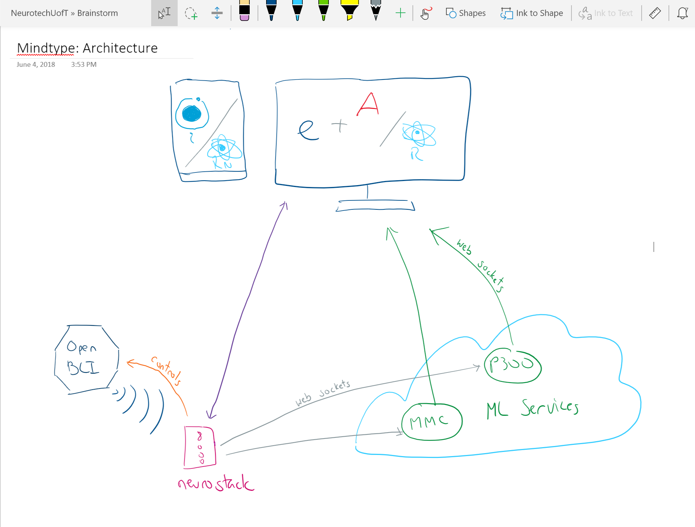

Attendees: Sayan, Jeremy

# Meeting Notes:
- Technologies
  - Electron can be made to be fast:
    - https://keminglabs.com/blog/building-a-fast-electron-app-with-rust/

- Architecture:
  
  - Neurostack:
    - Question: shoudl we just let the developer use whatever they want?
      ie:
        ```

          post(samples):
            do_something()

          if __name__ == "main":

              neurostack = Neurostack(
                  device = devices.OpenBCI,
                  subscribers = [
                      post(samples),
                      
                  ]
              )

        ```
    - Answer: no; easier for dev to just use sockets
  